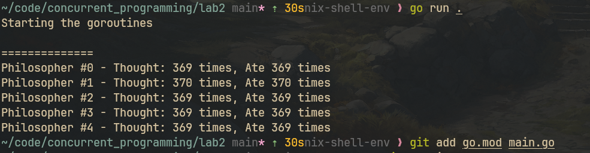
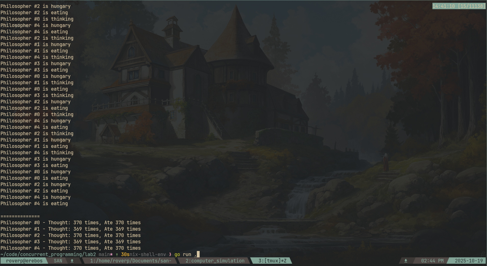

# Laboratorium 2 - Problem Ucztujących Filozofów

## Uruchomienie

```bash
nix develop # optional
go run main.go
```

Program działa przez 30 sekund i automatycznie kończy działanie, wyświetlając statystyki.

---

## Problem

**Problem ucztujących filozofów** to problem synchronizacji pokazujący wyzwania w zarządzaniu współdzielonymi zasobami. Pięciu filozofów siedzi przy okrągłym stole, na przemian myśląc i jedząc. Między każdą parą leży jeden widelec (zasób współdzielony). Aby jeść, filozof potrzebuje dwóch widelców: lewego i prawego.

Naiwna implementacja prowadzi do **zakleszczenia (deadlock)** gdy każdy filozof podniesie lewy widelec i czeka na prawy. Może również wystąpić **zagłodzenie (starvation)** gdy niektórzy filozofowie nigdy nie dostają szansy na jedzenie.

## Rozwiązanie

Implementacja wykorzystuje **wzorzec monitora** z Go: `sync.Mutex` do ochrony współdzielonego stanu i `sync.Cond` (zmienne warunkowe) do koordynacji dostępu do widelców.

Kluczowa zasada: **filozof może jeść tylko gdy obaj sąsiedzi NIE jedzą**. Sprawdzenie i zmiana stanu odbywa się atomowo w funkcji `test()`.

### Zapobieganie zakleszczeniu (deadlock-free)

Rozwiązanie jest wolne od zakleszczeń, ponieważ filozofowie używają **zmiennych warunkowych** do oczekiwania na widelce. W przeciwieństwie do naiwnego podejścia, gdzie filozofowie trzymają blokady podczas czekania, nasza funkcja `test()` pozwala na zmianę stanu na EATING tylko gdy **obaj sąsiedzi NIE jedzą**.

Wywołanie `Wait()` **zwalnia blokadę monitora**, pozwalając innym filozofom kontynuować pracę. To eliminuje cykliczne czekanie (circular wait), które powoduje zakleszczenie.

### Zapobieganie zagłodzeniu (starvation-free)

Rozwiązanie gwarantuje brak zagłodzenia, ponieważ gdy filozof kończy jedzenie w `putFork()`, **jawnie testuje obu sąsiadów** (lewego i prawego), czy mogą teraz jeść. Dzięki temu czekający filozofowie dostają sygnał gdy zasoby się zwolnią.

Kolejkowanie zmiennych warunkowych zapewnia sprawiedliwość. Wyniki pokazują zbalansowane liczby cykli (369-370), co potwierdza że żaden filozof nie został zagłodzony.

## Implementacja

Program implementuje problem 5 filozofów:

- **5 filozofów** działających jako osobne goroutines
- **30-sekundowa symulacja** kontrolowana przez `context.WithTimeout`
- **Maszyna stanów**: THINKING → HUNGRY → EATING → THINKING
- **Statystyki**: liczba cykli myślenia i jedzenia dla każdego filozofa

### Użyte mechanizmy synchronizacji:

- `sync.Mutex` - chroni współdzielony stan filozofów
- `sync.Cond` - realizuje wzorzec wait/notify dla każdego filozofa
- `context.Context` - kontroluje czas życia symulacji (30s)
- `sync.WaitGroup` - koordynuje zakończenie wszystkich goroutines

## Wyniki

### Statystyki finalne



### Z logami



Widoczny cykl: thinking → hungry → eating dla każdego filozofa.
