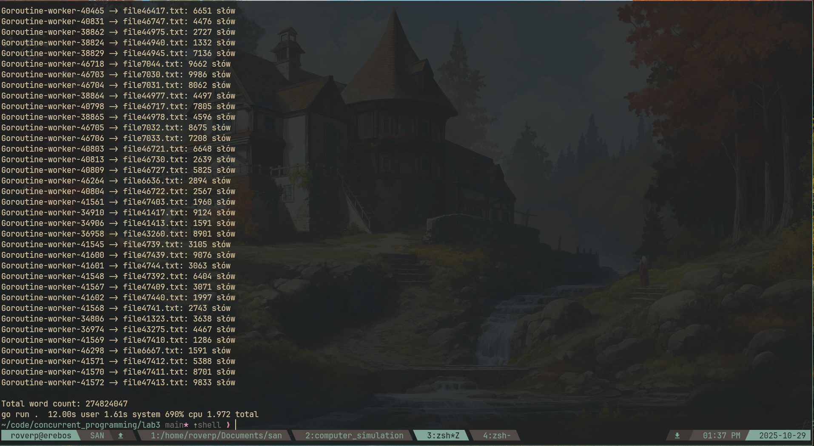

# Laboratorium 3 - Równoległe Zliczanie Słów

## Uruchomienie

```bash
nix develop # optional
go run main.go              # wyświetla wyniki
go run main.go > log.txt    # zapisuje log do pliku
```

---

## Implementacja

Program przetwarza wszystkie pliki `.txt` w katalogu `texts/` równolegle używając goroutines.

**`main()`:**

1. Rekurencyjnie znajduje wszystkie pliki `.txt` przez `filepath.WalkDir()`
2. Tworzy buforowany kanał i WaitGroup
3. Uruchamia goroutine dla każdego pliku
4. Zbiera wyniki z kanału i sumuje słowa

**`countWords()`:**

1. Odczytuje plik przez `os.ReadFile()`
2. Dzieli tekst na słowa przez `strings.Fields()`
3. Wysyła wynik do kanału
4. Oznacza zadanie jako zakończone przez `wg.Done()`

---

## Wyniki

### Screenshot wykonania



### Weryfikacja poprawności

Wynik zweryfikowany komendą:

```bash
wc -w $(find texts -name "*.txt")
```

**Łączna liczba słów: 274824047**

Wyniki się zgadzają.

## Alternative solution

```bash
find texts -name "*.txt" -print0 | xargs -0 -P$(nproc) -n100 wc -w | awk '{total += $1} END {print total/2}'
```
