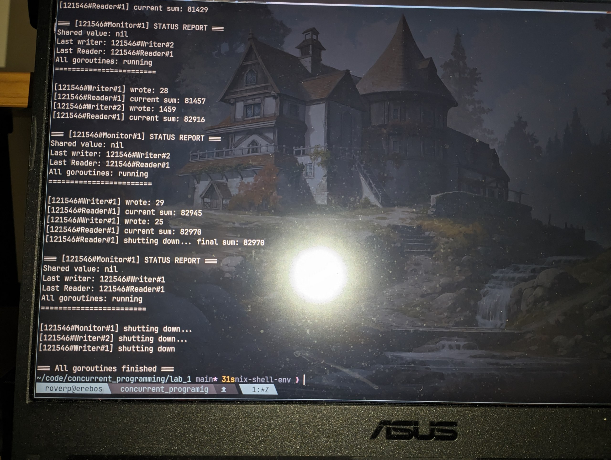

# Laboratorium 1 - Programowanie Współbieżne

## Uruchomienie

### Z użyciem Nix

```bash
nix develop
go run main.go
```

Program działa przez 30 sekund i automatycznie kończy wszystkie wątki.

---

## Odpowiedzi na pytania

### Różnica między PID a TID

**PID (Process ID)** identyfikuje cały proces w systemie operacyjnym. **TID (Thread ID)** identyfikuje konkretny wątek wewnątrz procesu. Jeden proces może mieć wiele wątków, więc jeden PID odpowiada wielu TID. W systemach Linux każdy wątek ma również swój unikalny identyfikator systemowy.

### Czym różni się wątek użytkownika od demonicznego?

**Wątek użytkownika** blokuje zakończenie programu - program czeka na jego zakończenie przed wyjściem. **Wątek demoniczny** nie blokuje zakończenia programu - jeśli pozostały tylko wątki demoniczne, program może się zakończyć, zabijając je natychmiast. W Go nie ma bezpośredniego odpowiednika; zamiast tego używa się `context` do kontrolowanego zamykania goroutines.

### Czy dobrą praktyką jest nienazywanie wątków?

**Nie, to zła praktyka.** ponieważ ułatwia debugowanie i identyfikację problemów w logach, pomaga w profilowaniu wydajności, zwiększa czytelność kodu etc etc

### Jak ważne jest ustawienie priorytetu wątku?

Ustawienie priorytetu ma **ograniczone znaczenie** w większości współczesnych aplikacji. Scheduler systemu operacyjnego ostatecznie podejmuje decyzje o przydziale czasu CPU, niezależnie od sugerowanych priorytetów. Priorytet może być użyteczny w systemach czasu rzeczywistego lub gdy jeden wątek jest krytyczny dla responsywności, ale nadużywanie może prowadzić do problemów takich jak **inwersja priorytetów**. W Go priorytet nie jest dostępny - runtime zarządza goroutines automatycznie według własnego algorytmu.

### Czym jest monitor w ujęciu programowania wielowątkowego?

**Monitor** to mechanizm synchronizacji wysokiego poziomu, który łączy dwa elementy: **mutex (mutual exclusion)** zapewniający, że tylko jeden wątek na raz może wykonywać kod chroniony, oraz **zmienne warunkowe (condition variables)** umożliwiające wątkom czekanie (`wait()`) i budzenie innych wątków (`notify()/notifyAll()`). Monitor gwarantuje atomowe operacje na współdzielonych danych i upraszcza programowanie współbieżne. W Javie realizuje się go przez `synchronized` + `wait()/notify()`, w Go przez `sync.Mutex` + `sync.Cond`. W tym programie struktura `SharedData` z mutexem i zmienną warunkową działa jako monitor.

---

## Implementacja

Program implementuje wzorzec **producent-konsument** z 4 goroutines:

- **T1 (121546#Writer#1)**: Producent generujący liczby z przedziału [21-37]
- **T2 (121546#Writer#2)**: Producent generujący liczby z przedziału [1337-4200]
- **T3 (121546#Reader#1)**: Konsument czytający wartości i sumujący je
- **T4 (121546#Monitor#1)**: Monitor raportujący stan systemu co 1 sekundę

### Użyte mechanizmy synchronizacji:

- `sync.Mutex` - zapewnia wyłączny dostęp do współdzielonej zmiennej
- `sync.Cond` - realizuje wzorzec wait/notify (odpowiednik Java monitor)
- `context.Context` - kontroluje czas życia goroutines (30 sekund)
- `sync.WaitGroup` - koordynuje zakończenie wszystkich goroutines

Program działa przez dokładnie 30 sekund, po czym wszystkie goroutines kończą pracę w kontrolowany sposób.


